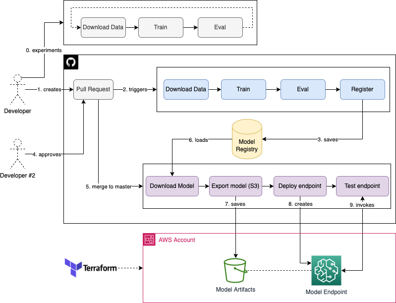

# Intro to ML Production

To be described

## Architecture Overview

  

## To do/improve

Last update: 14.06.2022

- Setup CloudWatch alarms
- GHA: Scheduled monitoring job
- GHA: Scheduled retraining job
- Move SageMakerExecutor role to Terraform
- Allow only for one model registered per Pull Request ID
- Trigger training/deploy pipeline only when `*.py` or `*.yml` file changes
